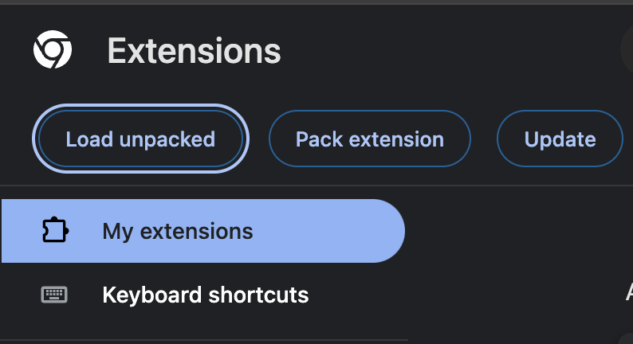
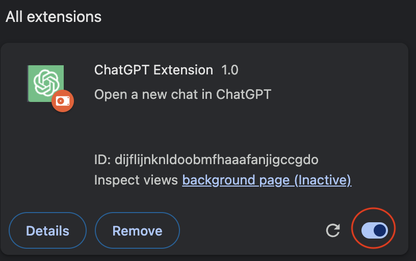
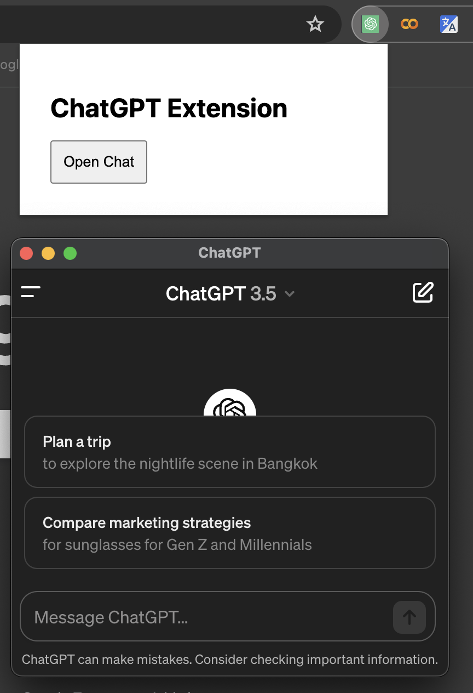

# browext
Browser Extension to have your intended site to be always by your side. ChatGPT used as an example.
## How to Use
Download or GIT clone to your local drive
```
git clone https://github.com/missedmyeye/browext.git
```
Edit the WEBSITE_URL variable in the .env file to your desired site.<br>
If you wish to have ChatGPT in your extension then leave it as it is.<br>
Open Google Chrome menu >>> Extensions >>> Manage extensions<br>
OR enter [chrome://extensions](chrome://extensions) into your search bar.<br>
Select `Load unpacked`<br>
<br>
Navigate to your folder and select it.<br>
Activate the extension<br>
<br>
Click on the icon to activate the extension and open the pop-up window<br>
<br>
